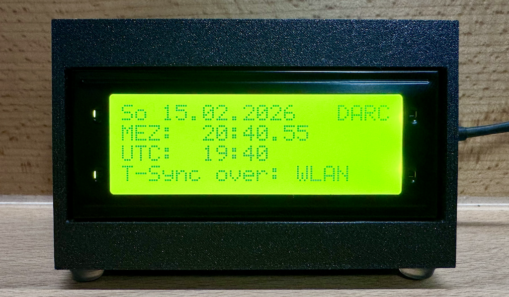
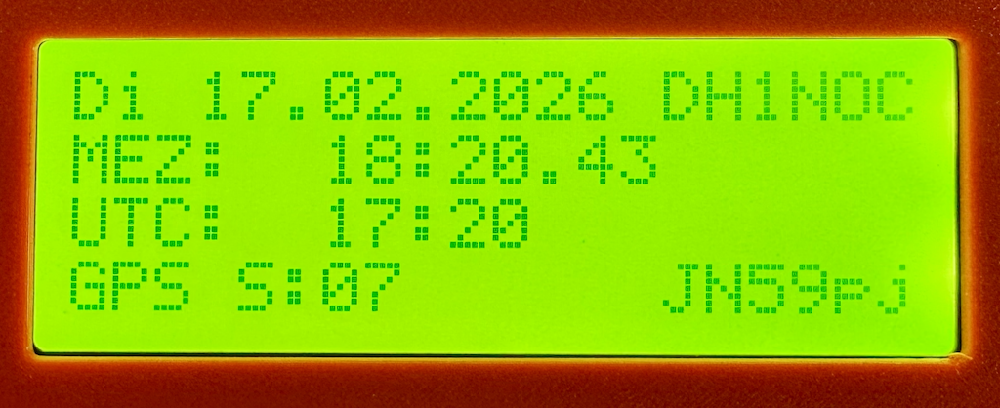

# Shack Präzisions-Weltzeituhr (Pico W)

Eine hochpräzise Amateurfunk-Stationsuhr auf Basis des Raspberry Pi Pico W. Sie kombiniert Internet-Zeit (NTP) mit einem temperaturkompensierten Echtzeit-Modul (DS3231) und visualisiert die Lokalzeit (MEZ/MESZ) sowie UTC parallel auf einem 2004 LCD-Display.

## Motivation & Konzept

Klassische Funkuhren auf **DCF77-Basis** stoßen in modernen Umgebungen oft an ihre Grenzen:

* **Empfangsprobleme:** Ferritstab-Antennen sind richtungsempfindlich; Signale werden in Gebäuden stark gedämpft.
* **Störanfälligkeit:** Schaltnetzteile, PCs und LED-Beleuchtung stören das Langwellensignal massiv.
* **Trägheit:** Ein vollständiger Zeitabgleich dauert nach dem Einschalten oft mehrere Minuten.
* **Fehlende UTC:** Handelsübliche Uhren zeigen meist nur die Lokalzeit, für den Funkbetrieb ist UTC jedoch essenziell.

**Die Lösung:**
Diese Uhr nutzt primär **NTP über WLAN** für die Genauigkeit und ein **RTC-Modul** für die Ausfallsicherheit.

* **Präzision:** Durch WLAN-Latenzen und MicroPython-Verarbeitung kann technisch ein Offset von ca. ±300ms auftreten. Dies ist für die visuelle Anzeige im Shack völlig akzeptabel.
* **Modularität:** Das integrierte GPS-Modul (GY-NEO6MV2) sorgt für Stratum-0-Präzision unabhängig vom Internet und ermöglicht die Anzeige des QTH-Locators.

---

## Hardware & Kosten

Die Gesamtkosten für das Projekt belaufen sich auf ca. **17€**.

### Teileliste

* **Mikrocontroller:** [Raspberry Pi Pico W (RP2040 WLAN)](https://www.berrybase.de/raspberry-pi-pico-w-rp2040-wlan-mikrocontroller-board)
* **GPS-Modul:** [u-blox NEO-6M / GY-NEO6MV2](https://amzn.eu/d/09GwwA2j)
* **RTC-Modul:** [DS3231 Real-Time Clock für Raspberry Pi](https://www.berrybase.de/ds3231-real-time-clock-modul-fuer-raspberry-pi)
* **Display (20x4 LCD mit I2C):**
* [Variante Weiß auf Blau](https://amzn.eu/d/08oH278n) oder
* [Variante Schwarz auf Grün](https://amzn.eu/d/0eiIwK74)


### Gehäuse (3D-Druck)

Es stehen zwei STL-Dateien für den Gehäusedruck zur Verfügung. Das Design ist so optimiert, dass **keine Stützen** notwendig sind:

* `Case_Front.stl` (Frontseite für Display und Pico)
* `Case_Back.stl` (Rückseite)

---

## Features

* **Timing:** Millisekunden-genaue Synchronisierung via GPS (Prio 1) oder NTP (Prio 2) mit Latenz-Korrektur.
* **Redundanz:** Dreistufiges Fallback-System: GPS -> WLAN/NTP -> DS3231 RTC.
* **Auto-Reconnect:** Automatische Wiederherstellung von WLAN und GPS-Fix im Hintergrund.
* **Smart Display (4 Zeilen):**
* Zeile 1: Datum, Wochentag und Callsign (rechtsbündig).
* Zeile 2: Lokalzeit (MEZ/MESZ).
* Zeile 3: UTC-Zeit.
* Zeile 4: Quelle (GPS/WLAN/RTC), bei GPS zusätzlich Satellitenanzahl & QTH Locator.

* **GPS-Integration:** Automatische Zeitsynchronisation und Positionsbestimmung (QTH Locator).
* **Debug-Modus:** Erweiterte Diagnose-Informationen für GPS und Systemstatus aktivierbar.
* **Boot-Animation:** Custom-Grafik eines Sendemasts mit Funkwellen beim Start.
* **Stabilität:** Modifizierter LCD-Treiber verhindert fehlerhafte Zeichen bei Soft-Resets.

---

## Verkabelung (Pinout)

Verwendet wird der I2C-Bus 0 des Pico W.

| Komponente | Pin | Pico W Pin | Farbe (Vorschlag) | Hinweis |
| --- | --- | --- | --- | --- |
| **DS3231 (RTC)** | VCC | **Pin 36 (3V3 OUT)** | Rot | 3.3V Versorgung |
|  | GND | **Pin 38 (GND)** | Schwarz | Masse |
|  | SDA | **Pin 1 (GP0)** | Blau | I2C Daten |
|  | SCL | **Pin 2 (GP1)** | Gelb | I2C Takt |
| **LCD 2004** | VCC | **Pin 40 (VBUS)** | Rot | **5V** (für Kontrast!) |
|  | GND | **Pin 3 (GND)** | Schwarz | Masse |
|  | SDA | **Pin 1 (GP0)** | Blau | Parallel zur RTC |
|  | SCL | **Pin 2 (GP1)** | Gelb | Parallel zur RTC |
| **GPS (NEO-6M)** | VCC | **Pin 40 (VBUS)** | Rot | 3.3-5V |
|  | GND | **Pin 38 (GND)** | Schwarz | Masse |
|  | TX | **Pin 7 (GP5)** | Grün | An Pico RX |
|  | RX | **Pin 6 (GP4)** | Weiß | An Pico TX |

> **Wichtig:** SDA und SCL von Display und RTC werden parallel auf dieselben Pins am Pico geführt.

---

## Einrichtung & Installation

### Schritt 1: MicroPython Firmware installieren

1. Aktuelle `.uf2`-Datei für Pico W laden: [micropython.org](https://micropython.org/download/RPI_PICO_W/)
2. Pico mit gedrückter **BOOTSEL**-Taste per USB anschließen.
3. Datei auf das erscheinende Laufwerk kopieren.

### Schritt 2: Entwicklungsumgebung

1. [Thonny IDE](https://thonny.org/) installieren.
2. Unten rechts als Interpreter **MicroPython (Raspberry Pi Pico)** wählen.

### Schritt 3: Dateien übertragen

Folgende Dateien müssen auf den Pico geladen werden:

* `lcd_api.py`: Basis-Treiber.
* `pico_i2c_lcd.py`: Modifizierter Treiber mit Reset-Fix.
* `config.json`: Konfigurationsdatei für WLAN.
* `main.py`: Hauptprogramm.

---

## Konfiguration (`config.json`)

Mehrere Netzwerke können als Fallback hinterlegt werden.

```json
{
    "wifi": [
        {
            "ssid": "MEIN_WLAN",
            "password": "PASSWORT1"
        },
        {
            "ssid": "BACKUP_WLAN",
            "password": "PASSWORT2"
        }
    ],
    "ntp_server": "pool.ntp.org",
    "sync_interval_min": 60
}

```

---

## Bedienung & Betrieb





1. **Start:** Strom anschließen (USB).
2. **Boot:** Die "DH1NOC CLOCK" Animation läuft (Sendemast strahlt Wellen ab).
3. **Betrieb:**
* Die Uhr startet sofort mit der Zeit aus dem **RTC-Modul** (Anzeige: `T-Sync over: RTC`).
* Im Hintergrund verbindet sie sich mit dem WLAN.
* Sobald verbunden, erfolgt der NTP-Abgleich. Die Anzeige wechselt auf `T-Sync over: WLAN`.
* Ein kleiner Stern `*` unten rechts signalisiert einen aktiven Abgleich.


4. **Ausfallsicherheit:** Sollte das WLAN ausfallen, läuft die Uhr präzise über das RTC-Modul weiter.

---

## Troubleshooting

* **Leeres Display:** Kontrast am blauen Potentiometer des I2C-Backpacks (Rückseite Display) justieren.
* **Kryptische Zeichen:** Pico kurz komplett stromlos machen (Hard Reset).
* **Falsche Stunde:** Die Zeitzone ist auf Deutschland fest voreingestellt. Prüfe die Funktion `get_cet_time_and_dst` in der `main.py`.